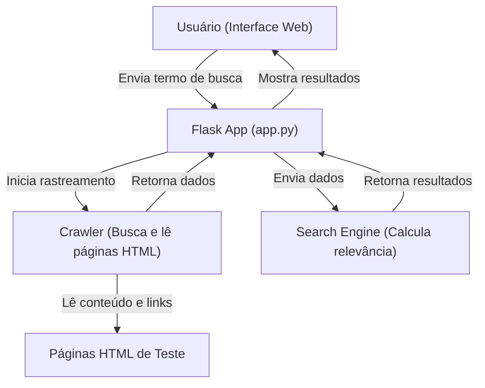
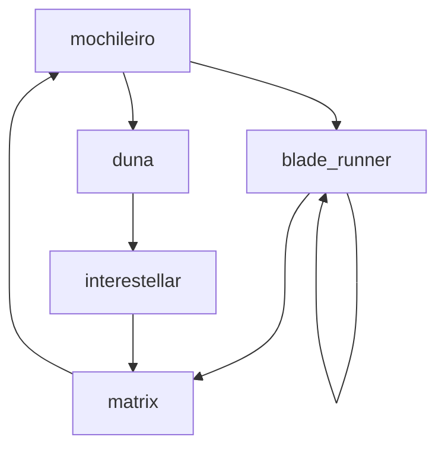

# 🌐 Buscador de Termos em Páginas Web - Projeto de Programação para Internet

Bem-vindo ao **Buscador de Termos em Páginas Web**, um projeto desenvolvido para a disciplina de Programação para a Internet I no Instituto Federal do Piauí (IFPI). Este README explica como o sistema funciona, como utilizá-lo e como ele foi estruturado.

---

## 📑 Sumário

1. [📖 Visão Geral](#-visão-geral)
2. [👥 Equipe](#-equipe)
3. [✨ Funcionalidades Principais](#-funcionalidades-principais)
4. [🛠️ Arquitetura do Sistema](#️-arquitetura-do-sistema)
5. [🔗 Grafo de Ligações das Páginas de Teste](#-grafo-de-ligações-das-páginas-de-teste)
6. [📂 Estrutura do Projeto](#-estrutura-do-projeto)
7. [🚀 Como Executar](#-como-executar)
8. [📜 Detalhes da Atividade](#-detalhes-da-atividade)
9. [💻 Tecnologias Utilizadas](#-tecnologias-utilizadas)

---

## 📖 Visão Geral

Este projeto consiste em um buscador web simplificado, capaz de:

- Rastrear páginas HTML a partir de uma URL inicial.
- Indexar o conteúdo textual e os links entre as páginas.
- Permitir buscas por termos específicos, ranqueando os resultados com base em critérios de relevância.

---

## 👥 Equipe

- **Álvaro Pietro**
- **João Paulo Lopes**
- **Thalysson Delano**

---

## ✨ Funcionalidades Principais

1. **🕷️ Crawler (Rastreador Web):**
   - Rastreia páginas HTML a partir de uma URL inicial.
   - Extrai conteúdo textual e links.
   - Evita duplicidade e loops infinitos.

2. **🔍 Search Engine (Motor de Busca):**
   - Calcula a relevância das páginas com base em:
     - **Autoridade da Página:** +10 pontos por link recebido.
     - **Frequência do Termo Buscado:** +5 pontos por ocorrência.
     - **Penalização por Autoreferência:** -15 pontos se a página se linka a si mesma.
   - Ordena os resultados por relevância.

3. **🌐 Interface Web:**
   - Desenvolvida com Flask.
   - Permite buscas e exibe resultados de forma clara.

---

## 🛠️ Arquitetura do Sistema

O diagrama abaixo mostra como as partes do sistema interagem:



### 📝 Explicação:

1. O **Usuário** acessa a interface web e faz uma busca.
2. O **Flask App** coordena o processo, chamando o **Crawler** para rastrear páginas.
3. O **Crawler** lê o conteúdo das páginas e retorna os dados.
4. O **Search Engine** calcula a relevância das páginas e retorna os resultados.
5. O **Flask App** exibe os resultados para o usuário.

---

## 🔗 Grafo de Ligações das Páginas de Teste

O grafo abaixo mostra como as páginas HTML de teste estão conectadas, incluindo a autorreferência na página `blade_runner.html`:



### **Legenda:**

- `mochileiro.html`
- `duna.html`
- `blade_runner.html` (possui autorreferência)
- `matrix.html`
- `interestellar.html`

---

## 📂 Estrutura do Projeto

A estrutura do projeto é organizada da seguinte forma:

```
terms-search/
│
├── classes/                     # Módulo contendo as classes principais
│   ├── Crawler.py               # Classe responsável pelo rastreamento das páginas
│   └── SearchEngine.py          # Classe responsável pelo cálculo de score e ranqueamento
│
├── static/                      # Arquivos estáticos (CSS, imagens, JS)
│   ├── style.css                # Folha de estilo da interface
│   ├── background.jpg           # Imagem de fundo
│   └── favicon.ico              # Ícone da aba do navegador
│
├── templates/                   # Templates HTML para o Flask
│   └── index.html               # Página principal da interface de busca
│
├── app.py                       # Arquivo principal da aplicação Flask (controlador)
├── requirements.txt             # Dependências do projeto Python
└── README.md                    # Este arquivo
```

---

## 🚀 Como Executar

### Pré-requisitos

- Python 3.x
- Um servidor HTTP local para servir as páginas HTML de teste (ex: `python -m http.server 8000`).

### Passos

1. **Clonar o Repositório:**
    ```bash
    git clone <url-do-repositorio>
    cd terms-search
    ```

2. **Criar e Ativar um Ambiente Virtual:**
    ```bash
    python -m venv venv
    # Windows
    venv\Scripts\activate
    # macOS/Linux
    source venv/bin/activate
    ```

3. **Instalar as Dependências:**
    ```bash
    pip install -r requirements.txt
    ```

4. **Configurar a URL Base das Páginas de Teste:**
    - Inicie um servidor HTTP local no diretório das páginas HTML:
        ```bash
        python -m http.server 8000
        ```
    - Defina a variável de ambiente `BASE_URL`:
        ```bash
        export BASE_URL="http://localhost:8000/"
        ```

5. **Executar a Aplicação Flask:**
    ```bash
    python app.py
    ```

6. **Acessar no Navegador:**
    Abra `http://localhost:5000/`.

---

## 📜 Detalhes da Atividade

- **Análise de Páginas:** Estudo de 5 páginas HTML com links entre si e uma autorreferência.
- **Implementação do Crawler:** Rastreia páginas, evita duplicidade e loops.
- **Critérios de Ranqueamento:**
  - +10 pontos por link recebido.
  - +5 pontos por ocorrência do termo buscado.
  - -15 pontos por autorreferência.
- **Critérios de Desempate:**
  1. Maior número de links recebidos.
  2. Maior quantidade de termos.
  3. Ausência de autorreferência.

---

## 💻 Tecnologias Utilizadas

- **Python:** Linguagem principal.
- **Flask:** Framework web.
- **Requests:** Para requisições HTTP.
- **Beautiful Soup 4:** Para parsear HTML.
- **HTML/CSS:** Para a interface web.
- **Mermaid:** Para diagramas no Markdown.

---
